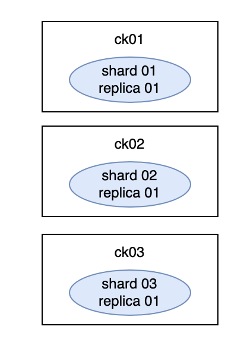

# clickhouse-cluster-docker
通过 docker-compose 快速部署一个开发环境的 clickhouse cluster

## 集群规划
```shell
zookeeper 3.6
clickhouse-server 20.8

ck 为 3 shards 1 replica

默认用户名密码：default/default
```




## 部署步骤
* 创建本地目录，具体挂载情况可以参考 yml 文件
```shell
mkdir -p ~/apps/clickhouse/ck01/conf
mkdir -p ~/apps/clickhouse/ck01/data
mkdir -p ~/apps/clickhouse/ck01/logs

mkdir -p ~/apps/clickhouse/ck02/conf
mkdir -p ~/apps/clickhouse/ck02/data
mkdir -p ~/apps/clickhouse/ck02/logs

mkdir -p ~/apps/clickhouse/ck03/conf
mkdir -p ~/apps/clickhouse/ck03/data
mkdir -p ~/apps/clickhouse/ck03/logs
```

* config*.xml 和 users.xml 移动到 conf 目录下，目录结构如下
```shell
.
├── ck01
│   ├── conf
│   │   ├── config_ck01.xml
│   │   └── users.xml
│   ├── data
│   └── logs
├── ck02
│   ├── conf
│   │   ├── config_ck02.xml
│   │   └── users.xml
│   ├── data
│   └── logs
└── ck03
    ├── conf
    │   ├── config_ck03.xml
    │   └── users.xml
    ├── data
    └── logs
```

- 执行 docker-compose 首次启动集群
```shell
docker-compose -f ck_1zk_3shards_1replica.yml -p ck_cluster_dev up -d
```

- 可以进入容器执行 clickhouse-client 查看集群分片或者直接使用 dbeaver 连接
```shell
docker exec -it clickhouse-server-ck01 bash

root@ck01:/# clickhouse-client -u default --password
ClickHouse client version 20.8.19.4 (official build).
Password for user (default):
Connecting to localhost:9000 as user default.
Connected to ClickHouse server version 20.8.19 revision 54438.

ck01 :) select * from system.clusters;

SELECT *
FROM system.clusters

┌─cluster────────┬─shard_num─┬─shard_weight─┬─replica_num─┬─host_name─┬─host_address─┬─port─┬─is_local─┬─user────┬─default_database─┬─errors_count─┬─estimated_recovery_time─┐
│ ck_cluster_dev │         1 │            1 │           1 │ ck01      │ 172.16.1.6   │ 9000 │        1 │ default │                  │            0 │                       0 │
│ ck_cluster_dev │         2 │            1 │           1 │ ck02      │ 172.16.1.7   │ 9000 │        0 │ default │                  │            0 │                       0 │
│ ck_cluster_dev │         3 │            1 │           1 │ ck03      │ 172.16.1.8   │ 9000 │        0 │ default │                  │            0 │                       0 │
└────────────────┴───────────┴──────────────┴─────────────┴───────────┴──────────────┴──────┴──────────┴─────────┴──────────────────┴──────────────┴─────────────────────────┘

3 rows in set. Elapsed: 0.015 sec.
```

- 启停集群
```shell
# 启动
docker-compose -f ck_1zk_3shards_1replica.yml -p ck_cluster_dev start

# 可能会出现停止失败的情况，建议使用 docker stop 一个个的 container 手动停
docker-compose -f ck_1zk_3shards_1replica.yml -p ck_cluster_dev stop

# 停止并删除 container
docker-compose -f ck_1zk_3shards_1replica.yml -p ck_cluster_dev down
```

- 如果在 macos 下出现停止失败的情况
```shell
xxx tried to kill container, but did not receive an exit event

# kill docker 进程，然后重新启动 docker
killall Docker
```


